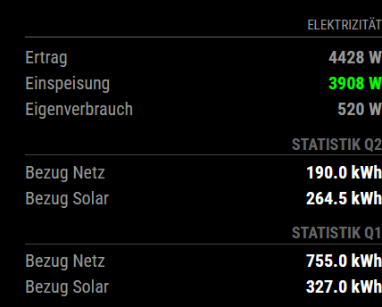

This is a Huawei-SmartMeter Module for <a href="https://magicmirror.builders/">MagicMirror²<a/>

For reading the data of your solar system, an esp8226 D1 mini is needed. the esp32 is connected to raspberry pi by uart.
this way is to prefer. the huawei equipment is connected to the guest-wlan while your raspberry is in your private wlan ,-)

you have to add following line to your /boot/firmware/config.txt on raspberry to enable the uart on pin 26/13

#\ overlay for uart at gpio 26/13 for esp32 bridge to huawei

dtoverlay=uart1-pi5

SoftwareSerial for Raspberry Pi 5 (TX at GPIO 26 / RX at GPIO 13 of Pi)
// ESP8266: D5 (GPIO14) is TX, D6 (GPIO12) is RX

you have also to enable the mod-bus accessibility on huawei dongle.
go to fusion-solar web portal, login as owner and select:
Monitoring/Panel-System/Dongle/Configuration=>Modbus-TCP=>activate
